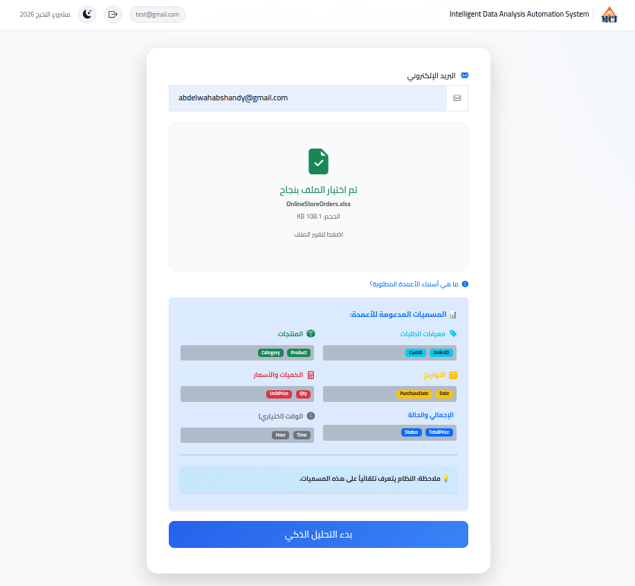
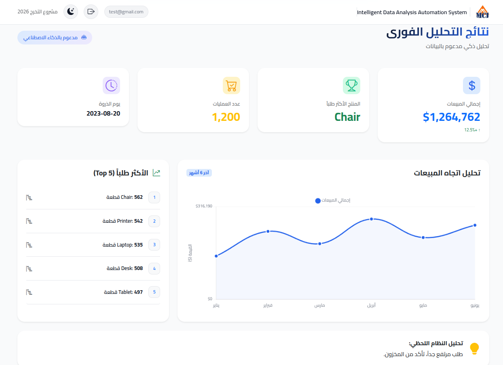
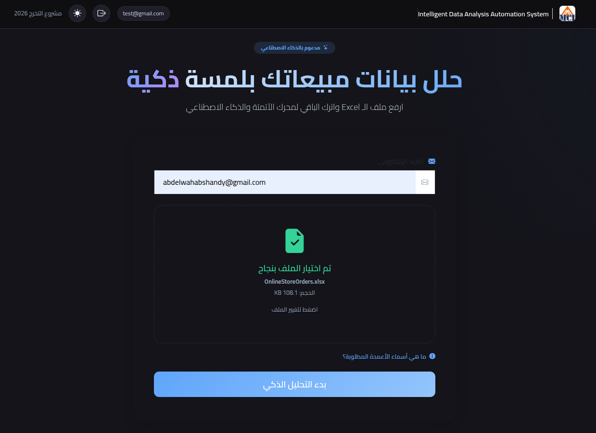
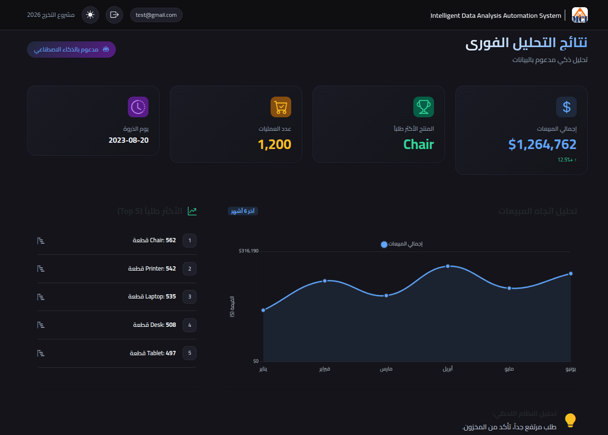
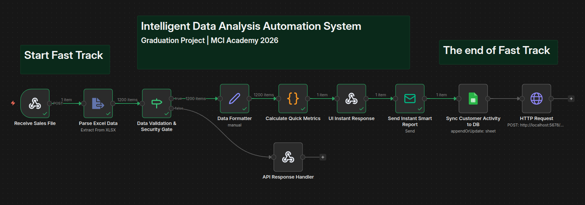
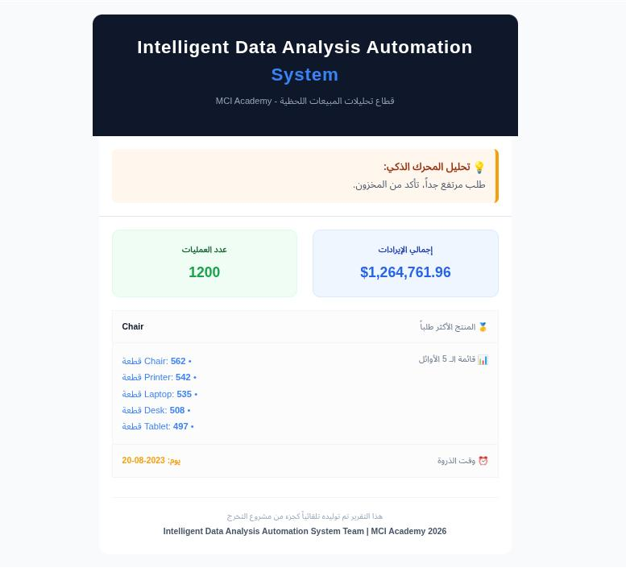
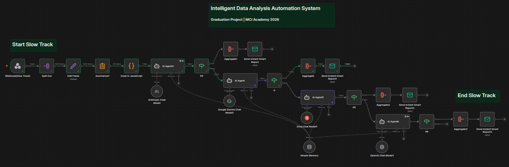

# 📊 Intelligent Data Analysis Automation System

<p align="center">
  
</p>

<p align="center">
  <strong>Graduation Project – MCI Academy 2026</strong><br>
  An Automated, AI-powered Business Intelligence pipeline using <b>n8n</b>, <b>AI Agent</b>, and <b>Excel</b>.
</p>

<p align="center">
  
  
  
  
</p>
 
---

## 🧠 Project Overview

The Intelligent Data Analysis Automation System is an intelligent ecosystem designed to bridge the gap between raw data and executive decision-making. It transforms standard Excel sales data into high-level strategic insights through a professional data analyst's workflow.

🔄 The Intelligent Pipeline:
- 🔐 Secure Auth: Multi-user system with encrypted passwords (Bcrypt).

- ⚡ Fast Track: Instant KPI extraction (Total Sales, Top Products) and real-time Chart.js visualization.

- 🧠 Slow Track: Strategic AI-driven analysis (SWOT, Trends) delivered via automated n8n workflows.

---

## 🚀 Key Features

* **Agnostic Data Ingestion**: Upload any standard Excel sales file; the system adapts to the schema.
* **Dynamic Dashboard**: Real-time visual feedback using Chart.js/Bootstrap.
* **Security Gate**: Backend MIME-type validation to prevent malicious file uploads.
* **AI Strategic Reporting**: Full business analysis (SWOT, Trends, Forecasts) generated via LLMs.
* **Direct Outreach**: Automated multi-stage email delivery via SMTP.

---

## 🏗️ System Architecture

### 🔁 Workflow Orchestration
The core logic resides in **n8n**, where incoming Webhooks trigger parallel execution streams:

#### 1. Fast Track (Latency: < 2s)
* **Validation**: Strict MIME-type checking for data integrity.
* **Aggregation**: Real-time calculation of Total Revenue, Order Volume, and Top Products.
* **Delivery**: Updates the frontend via JSON and sends a "Quick Glance" email.

#### 2. Slow Track (Executive Intelligence)
* **Contextual Analysis**: Data is batch-processed and sent to an AI Agent (GPT-4o/Claude) for qualitative insights.
* **Strategic Email Delivery**: Instead of static files, the AI crafts a professional, structured email report containing SWOT analysis and actionable business recommendations.

---

## 🖥️ Project Showcase

### 1️⃣ Intelligent Dashboard
> **Light Mode**
> **Operation Workflow:** From an empty state to a data-rich environment.

| Initial State | Processed Results |
| :---: | :---: |
|  |  |
| *Secure upload zone & RTL support* | *Real-time KPIs & Sales Trend Analysis* |

> **Dark Mode**
> **Operation Workflow:** From an empty state to a data-rich environment.

| Initial State | Processed Results |
| :---: | :---: |
|  |  |
| *Secure upload zone & RTL support* | *Real-time KPIs & Sales Trend Analysis* |


---

### 2️⃣ Fast Track Logic & Outreach
> **The Automation Backbone:** Visualizing the n8n logic and the immediate user feedback.

<div align="center">
  
  <p><i>n8n workflow handling ingestion and security validation.</i></p>
</div>

> **Instant Insight Email:**
<div align="center">
  
  <p><i>Automated HTML summary sent within seconds of upload.</i></p>
</div>

---

### 3️⃣ Slow Track (Strategic AI Analysis)
> **Advanced Intelligence:** The transition from raw numbers to executive-level strategy delivered via email.

<div align="center">
  
</div>

<details>
<summary><b>📧 Click to View Sample Strategic AI Email Report (Detailed)</b></summary>
<br>
<div align="center">
  
</div>

<div align="center">
  
</div>

<div align="center">
  
    <p><i>The final AI-generated strategic report, sent as a high-level executive email.</i></p>
</div>
</details>

---
---

## 🎯 System Logic & User Journey

The system is designed to provide a seamless transition from raw data ingestion to deep strategic intelligence, following a structured **Event-Driven** approach.

### 1️⃣ Operational Workflow
1.  **Data Ingestion**: User uploads an Excel/CSV sales file via the secure dashboard.
2.  **Fast Track (Synchronous)**: The system validates the file and immediately pushes KPIs and charts to the UI.
3.  **Initial Alert**: A "Quick Glance" confirmation email is dispatched via SMTP.
4.  **Slow Track (Asynchronous)**: The AI Agent initiates a deep-dive analysis in the background.
5.  **Strategic Delivery**: A final, comprehensive AI-generated report is sent directly to the user's inbox.

---

### 2️⃣ Architecture & Logic Diagrams
> Visualizing the interaction between the User, n8n Orchestrator, AI Agent, and Mail Servers.

#### **A. Use Case Diagram**
*High-level view of system boundaries and actor interactions.*
<div align="center">
  
</div>

#### **B. Sequence Diagram (Execution Flow)**
*Detailed execution timeline showing the Synchronous vs. Asynchronous processing paths.*
<div align="center">
  
</div>

---
## 🗂️ Project Structure

```bash
Smart-BI-Project/
├── Backend/            # Flask API & SQLite Engine
│   ├── SmartBi.py      # Core Backend Logic
│   └── DataBase/       # SQL Schemas & database.db
├── Frontend/           # UI Components (HTML, CSS, JS)
│   ├── auth.html       # Secure Entry Point
│   └── index.html      # Analytics Dashboard
├── n8n-Workflows/      # Automation .json exports
├── Samples/            # Standardized Excel datasets
└── Manual Analysis/    # Benchmarks (Jupyter Notebooks)
```
---

## 🧩 Technologies Used

* Backend: Python 3.10, Flask, Flask-CORS.

* Security: Hashed passwords using bcrypt (Salted).

* Database: SQLite (Relational, File-based for high-speed local processing).

* Frontend: Bootstrap 5 (RTL Support), Chart.js, Vanilla JavaScript.

* Automation: n8n (Webhook-driven reporting).

---

## 👥 Project Team

**Abdelwahab Shandy – Team Lead**

**Hadeer Abdelaziz**

**Hamed Tarek**

**Howarah Ali Abdo**

**Marwan Singer**

**Sanaa Ahmed Mohamed** 

**Abdelrahman Taher**


---

## 🏁 Core Idea

> **Turning data into a competitive advantage by automating the bridge between Excel and AI.**

---

⭐ If you find this project useful, please consider giving it a star!

_Graduation Project – MCI Academy 2026_